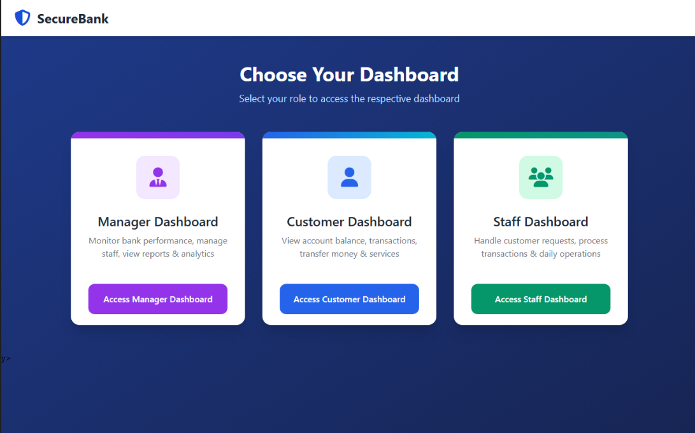
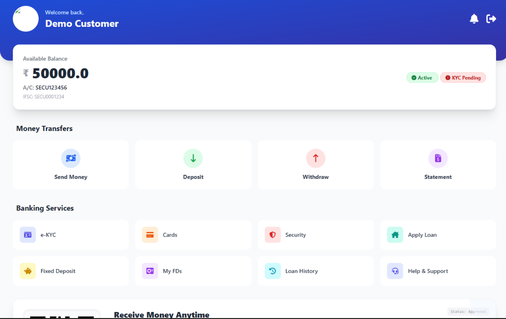
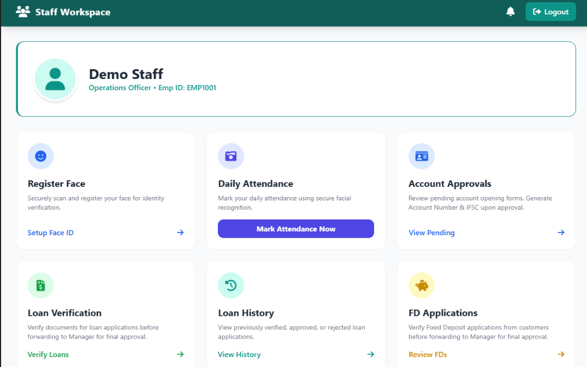
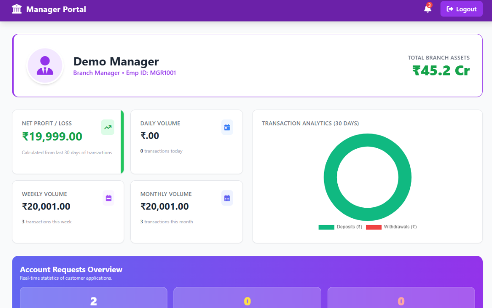

# 🏦 Secure Bank - Digital Banking Application

Secure Bank is a modern and secure banking application developed using Spring Boot, Thymeleaf, Hibernate, JPA, and MySQL. The system provides separate dashboards for Customers, Staff, and Managers, enabling efficient and secure banking operations.

---

## 🚀 Features

### 👤 Customer Module
- Customer Registration and Login
- Open New Bank Account
- Deposit Money
- Withdraw Money
- Fund Transfer
- View Account Details
- Mini Statement
- Loan Application
- Fixed Deposit Request
- Debit/Credit Card Request
- e-KYC Verification

### 👨‍💼 Staff Module
- Staff Login
- View Pending Accounts
- Approve or Reject Accounts
- Handle Customer Queries
- Face Attendance System
- Loan Processing

### 👨‍💻 Manager Module
- Manager Login
- Add and Manage Staff
- View Attendance Records
- Salary Management
- Meeting Scheduling
- Approve Loans and Fixed Deposits
- Generate Reports

### 🔒 Security Features
- OTP Verification
- Role-Based Authentication
- Secure Login System
- e-KYC Verification

---

## 🛠️ Technologies Used

### Backend
- Java
- Spring Boot
- Spring MVC
- Spring Data JPA
- Hibernate

### Frontend
- HTML
- CSS
- JavaScript
- Thymeleaf

### Database
- MySQL

### Build Tool
- Maven

---

## 📂 Project Structure

```
src
├── main
│   ├── java
│   │   ├── controller
│   │   ├── service
│   │   ├── repository
│   │   ├── entity
│   │   ├── config
│   │   └── dto
│   └── resources
│       ├── templates
│       ├── static
│       └── application.properties
```

---

## ⚙️ Installation

### Clone Repository

```bash
git clone https://github.com/yourusername/SecureBank.git
```

### Open Project

Import the project into IntelliJ IDEA or Spring Tool Suite.

### Configure Database

Update `application.properties`

```properties
spring.datasource.url=jdbc:mysql://localhost:3306/secure_bank
spring.datasource.username=root
spring.datasource.password=your_password
```

### Run Application

```bash
mvn spring-boot:run
```

### Open Browser

```
http://localhost:8080
```

---

## 🗄️ Database Tables

- User
- AccountOpening
- Transaction
- LoanRequest
- FixedDeposit
- CardRequest
- Attendance
- StaffSalary
- QueryMessage
- Notification

---

## 📸 Screenshots

### Home Page


### Customer Dashboard


### Staff Dashboard


### Manager Dashboard


---

## 🔮 Future Enhancements

- QR Code Payment System
- UPI Integration
- SMS Notifications
- Mobile Banking Application
- AI Chatbot Support
- Real-Time Transaction Alerts

---

## 👨‍💻 Author

**Nikita Ishwar Prajapati**

B.Tech Computer Engineering

Java Full Stack Developer

---

## ⭐ If you like this project, don't forget to give it a star!
